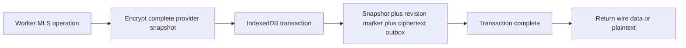

# OpenMLS binding and encrypted-state experiment

Updated: 2026-10-03. This continues [ADR 0001](adr/0001-crypto-stack.md) in an isolated evaluation. The production apps and `@vault/crypto` still have no active encryption adapter or real accounts/messages.

## Implemented

`spikes/crypto/adapter/lib.rs` delegates key packages, groups, sending/receiving, self-update, member removal and group restoration to the pinned OpenMLS 0.9.0 APIs. It replaces the experimental WASM binding only; it does not change the protocol source or implement a ratchet. Its locked build adds the already locked serde_json crate for the storage snapshot representation.

Wire inputs are checked against caller-provided limits before decoding. Decoding rejects trailing bytes and wrong message kinds. Errors expose fixed codes without dumping decoded structures. Self-removal and overwriting an existing group are blocked. Provider, identity signer and group state can be restored from a bounded snapshot. Private snapshot bytes are consumed only inside the state Worker; there is no snapshot/private-key export RPC.

The Worker serializes operations. Any error closes that instance and clears its live references; callers must restore a fresh Worker from committed state. A failure after mutation never releases a message. Limits for wire bytes, snapshot bytes and pending outbox entries are required parameters; fixture defaults are confined to the demo harness. Production values must come from authenticated settings/env.

## Storage and crash boundary



Snapshots use Web Crypto AES-256-GCM with a fresh random 96-bit IV. Authenticated additional data binds schema, storage namespace and revision. The unlock key is a non-extractable CryptoKey supplied at runtime; it is never written to IndexedDB. The schema stores only encrypted snapshot envelopes, a revision marker and outgoing wire records. Production namespaces must use opaque device identifiers; the harness uses named demo identities.

Snapshot, revision marker and outgoing wire data commit atomically with a requested `strict` durability hint. Unsupported strict transactions fail with `STRICT_STORAGE_UNSUPPORTED`; the experiment does not silently lower durability. Revision comparison prevents two stale Workers from both committing and releasing their newly generated ciphertext. A snapshot/marker mismatch rejects a partial state rollback. Outbox capacity aborts the entire transaction and closes the Worker. If the transaction committed but its reply was lost, recovery reads the existing outbox wire bytes rather than re-encrypting the message.

The browser's durability option is a hint, not a guarantee against every power-loss/filesystem failure. [IndexedDB specification](https://w3c.github.io/IndexedDB/#dom-idbtransaction-durability).

The local marker does **not** detect an attacker restoring the entire database, including both snapshot and marker. Importing an old live MLS snapshot is not a supported backup recovery path. Production backup recovery must create a fresh device/protocol state and restore history separately, or use a reviewed freshness mechanism. Never treat AES-GCM authentication alone as rollback protection. Same-origin XSS and a compromised unlocked device remain outside this protection.

## Verification

In the official Playwright 1.63.0 Noble container: **50 passed, no skips**, across Chromium, WebKit, Firefox, Android Chromium emulation and iPhone WebKit emulation. Fifteen cases preserve the original unchanged-upstream experiment; 35 cases cover the new boundary:

- Worker restart with restored signer/group state, subsequent traffic, replay rejection and wrong-key rejection.
- Typed rejection of malformed, wrong-kind, oversized and trailing input; no upstream malformed-input trap in the new path; snapshot RPC denial.
- Self-update, third-member addition, removal and failure of the removed member to decrypt later traffic.
- Competing stale writers, with exactly one successful commit/released ciphertext and successful subsequent traffic.
- Actual aborted IndexedDB send transaction, unchanged revision/outbox, closed Worker and successful restoration.
- A test-only Worker fixture dropping the response after commit, with the exact queued message recovered and the next sending generation accepted.
- Tampered/transplanted encrypted snapshots, missing restore state and a snapshot/marker rollback mismatch.

The lost-response fixture is served only by the isolated loopback test server. It is not an application capability. `pnpm check` passes separately.

These results cover Worker termination/recreation and controlled failure windows, not physical phone testing, operating-system power loss, a full credential-unlocked page reload, IndexedDB eviction recovery or an independent security audit. The owner's earlier iPhone report applies only to the Phase 0 shell.

## Reproduce

On the Linux x86-64 toolchain described in [spike instructions](../spikes/crypto/README.md):

```sh
pnpm build:crypto-spike
pnpm build:crypto-spike --adapter
pnpm test:crypto-spike
```

Generated upstream/adapter files are separate and ignored. Provenance records the pinned upstream revision/compiler/bindgen and the application binding source hash. Crypto spike CI builds both artifacts and runs the combined matrix. The regular app CI remains separate.

## Required next

This code is not independently audited or approved for production. The core audit scope in ADR 0001 is unchanged. Still required: review providers/Rust advisories and licensing; authenticate device credentials and expose verifiable identity information; passphrase Argon2id/WebAuthn PRF unlock and key wrapping; encrypted message-history storage; outbox acknowledgement/pruning and delivery ordering; membership/concurrent-commit policy; reviewed snapshot migration/recovery; browser/physical-device persistence checks; full state-machine/fuzz/security review. JavaScript strings and Rust/JS allocations are not claimed to provide guaranteed zeroization.

Next implement the credential-unlock and verified device boundary before connecting account activation/key registration. Admin roles must not change MLS membership/privacy, and admin-origin authentication/session storage must remain separate.
